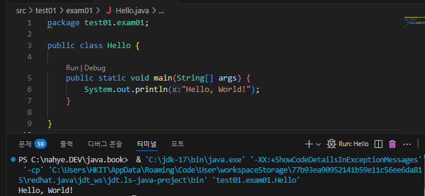
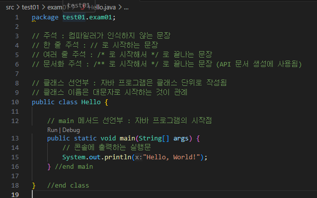
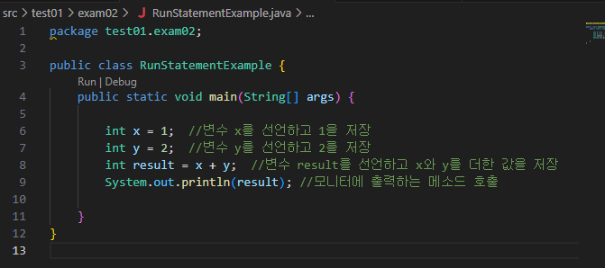

# chapter01 자바 시작하기
## 1-1 프로그래밍 언어와 자바

### 핵심정리
- 기계어: 컴퓨터(운영체제)가 이해하고 실행할 수 있는 0과 1로 이루어진 코드를 말합니다.
- 프로그래밍 언어: 사람이 기계어를 이해하는 것은 매우 어렵기 때문에 사람의 언어와 기계어의 다리 역할을 합니다. 종류로는 C, C++, 자바, 파이썬 등이 있습니다.
- 소스 파일: 프로그래밍 언어로 작성된 파일을 말합니다.
- 컴파일: 소스 파일을 기계어로 번역하는 것을 말합니다. 이 역할을 담당하는 소프트웨어를 컴파일러라고 합니다.
- JDK: 자바 개발 도구의 줄임말로, 자바로 프로그램을 개발할 수 있는 실행 환경과 개발 도구(컴파일러) 등을 제공합니다.
- 환경 변수: 운영체제가 실행하는 데 필요한 정보를 제공해주는 변수를 말합니다. JDK를 설치한 후 명령 라인(명령 프롬포트, 터미널)에서 컴파일러와 실행 명령어를 사용하려면 JAVA_HOME 환경 변수를 등록하고 path 환경 변수를 수정하는 것이 좋습니다.

### 문제
1. o/x
-소스 파일이란 컴퓨터가 이하는 기계어로 구성된 파일이다 (x)
-자바 언어로 프로그램을 개발하기 위해서는 JDK를 설치해야 한다 (o)
-JDK가 설치되면 기본적으로 C:\Program Files\Java 폴더가 생성된다 (o)
-자바 컴파일러와 실행 명령어는 JDK설치 폴더 \bin 폴더에 있다 (o)
 
2. JDK 설치 폴더 안의 bin 폴더를 path 환경 변수에 등록하는 이유는?
다른 경로에서 bin 폴더 안에 있는 명령어를 사용할 수 있도록 하기 위해

## 1-2이클립스 개발 환경 구축

### 핵심정리
-이클립스: 무료료 사용할 수 있는 오픈 소스 통합 개발 환경입니다. IDE란 프로젝트 생성, 자동 코드 완성, 디버깅 등과 같이 개발에 필요한 여러 가지 기능을 통합적으로 제공해주는 툴을 말합니다.
-워크스페이스: 이클립스 실행과 관련된 메타 데이터와 프로젝트 폴더가 저장되는 폴더를 말합니다.
-뷰: 이클립스 내부에서 사용되는 작은 창을 말합니다.
-퍼스펙티브: 프로젝트를 개발할 때 유용하게 사용할 수 있는 뷰들을 미리 묶어 이름을 붙여놓은 것을 말합니다.

### 문제
1. 이클립스 o/x
- 이클립스는 무료이며 통합 개발 환경(IDE)을 제공한다 (o)
- 이클립스를 실행할 때는 워크스페이스를 지정해야 한다 (o)
- 이클립스는 자바 프로그램만 개발할 수 있ek (x)
- 퍼스펙티브는 뷰들을 미리 묶어 이름을 붙여 놓은 것이다 (o)

## 1-3 자바 프로그램 개발 과정

src/test01/exam01/Hello.java
기본 구성

기본 구성-주석

 
src\test01\exam02\RunStatementExample.java
실행문

 

### 핵심정리
-바이트 코드 파일: 자바 소스 파일을 javac 명령어로 컴파일한 파일을 말합니다.
-JVM: 자바 가상 기계는 바이트 코드 파일을 운영체제를 위한 완전한 기계어로 번역하고 실행하는 역할을 합니다.
-클래스 선언: 자바 소스 파일은 클래스 선언부와 클래스 블록으로 구성됩니다. 이렇게 작성하는 것을 클래스 선언이라고 합니다.
-main() 메소드: java 명령어로 바이트 코드 파일을 실행하면 제일 먼저 main() 메소드를 찾아 블록 내부를 실행합니다. 그래서 main() 메소드를 프로그램 실행 진입점이라고 부릅니다.
-주석: 주석은 프로그램 실행과는 상관없이 코드에 설명을 붙인 것을 말합니다. 주석은 컴파일 과정에서 무시되고 실행문만 바이트 코드로 번역됩니다.
-실행문: 변수 선언, 값 저장, 메소드 호출에 해당하는 코드를 말합니다. 실행문 끝에는 세미콜론(;)을 붙여야 합니다.

### 문제
1. 자바 프로그램 개발 과정을 순서대로 적어보세요 (2-1-3-4)
- 1 javac 명령어로 컴파일한다
- 2 소스 파일(~.java)을 작성한다
- 3 java 명령어로 실행한다
- 4 실행결과를 확인한다
 
2. 자바소스 o/x

- 컴파일하면 '클래스이름.class'라는 바이트 코드 파일이 생성된다 (o)
- main() 메소드는 반드시 클래스 블록 내부에서 작성해야 한다. (o)
- main() 메소드를 작성할 때 중괄호 블록을 만들지 않아도 된다 (X)
- 컴파일 후 실행을 하려변 반드시 main() 메소드가 있어야 한다
 
3. 주석 o/x
- //뒤의 라인 내용은 모두 주석이 된다 (o)
- /*부터 시작해서 */까지의 모든 내용이 주석이 된다 (o)
- 주석이 많으면 바이트 코드 파일의 크기가 커지므로 꼭 필요한 경우에만 작성한다 (x)
- 문자열 안에는 주석을 만들 수 없다 (o)
 
4. 이클립스-자바 프로젝트 o/x
- 기본적으로 소스 파일과 바이트 코드 파일이 저장되는 폴더가 다르다 (o)
- 자바 소스 파일을 작성하는 폴더는 src이다 (o)
- 선언되는 클래스 이름은 소스 파일 이름과 달라도 상관없다 (x)
- 올바르게 작성된 소스 파일을 저장하면 자동으로 컴파일되고, 바이트 코드 파일이 생성된다
 
5. 이클립스에서 바이트 코드 파일을 실행하는 방법 모두 체크 (3,4)
- 1 Package Explorer 뷰에서 소스 파일을 더블클릭한다
- 2 Package Explorer 뷰에서 바이트 코드 파일을 선택하고, 툴 바에서 Run 아이콘을 클릭한다
- 3 Package Explorer 뷰에서 소스 파일을 선택하고, 툴 바에서 Run 아이콘을 클릭한다
- 4 Package Explorer 뷰에서 소스 파일을 선택하고, 마우스 오른쪽 버튼을 클릭한 후 [Run As]-[Java Application]을 선택한다
