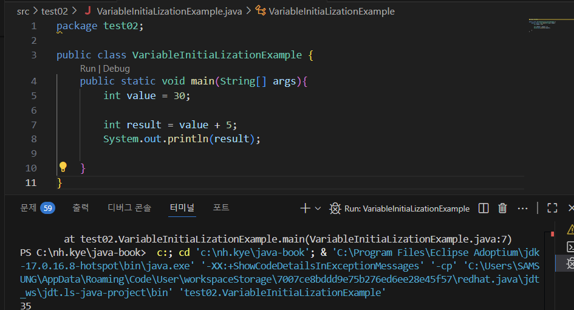
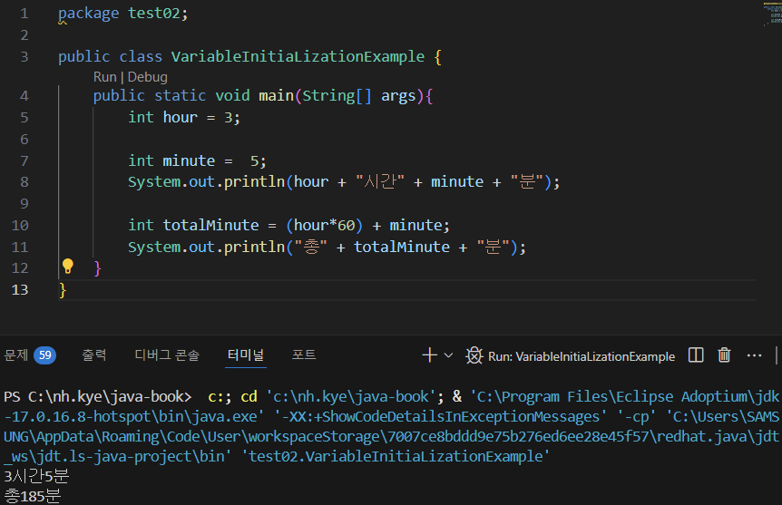
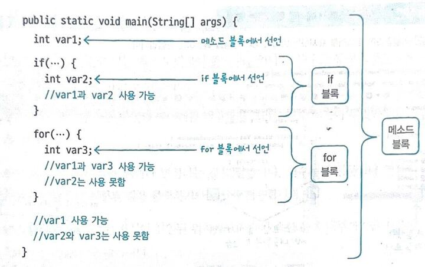

# 변수와 타입
## 2-1 변수
#### 변수
값을 저장할 수 있는 메모리의 특정 번지에 붙여진 이름

정수 타입에는 정수 값, 실수 타입에는 실수 값만 저장 가능하고 하나의 변수에 하나의 값만 저장 가능

#### 변수 선언
변수의 어떤 타입의 데이터를 저장할 것인지, 변수의 이름은 무엇인지 결정

정수(int)를 저장할 수 있는 age 변수 선언
실수(double)를 저장할 수 있는 value 변수 선언

- 변수 이름
  - 첫 글자는 문자/$/_로 시작 숫자/특수 문자X
  - 영어 대소문자 구분 필수
  - 첫 문자-소문자, 다른 단어 붙을 시 첫 글자 대문자
  - 문자 수 관계X
  - 자바 예약어X

| 분류               | 예약어                                                                                                                   |
| ---------------- | --------------------------------------------------------------------------------------------------------------------- |
| **접근 제어자**       | `public`, `protected`, `private`                                                                                      |
| **클래스/인터페이스 관련** | `class`, `interface`, `enum`, `extends`, `implements`                                                                 |
| **객체 관련**        | `new`, `this`, `super`, `instanceof`                                                                                  |
| **메서드 관련**       | `abstract`, `native`, `synchronized`, `final` (메서드/클래스/변수), `static`, `strictfp`                                      |
| **제어문**          | `if`, `else`, `switch`, `case`, `default`, `for`, `while`, `do`, `break`, `continue`, `return`, `assert`              |
| **예외 처리**        | `try`, `catch`, `finally`, `throw`, `throws`                                                                          |
| **변수/값 관련**      | `boolean`, `byte`, `short`, `int`, `long`, `float`, `double`, `char`, `true`, `false`, `null`                         |
| **패키지/모듈 관련**    | `package`, `import`, `module`, `open`, `opens`, `requires`, `exports`, `uses`, `provides`, `to`, `with`, `transitive` |
| **기타**           | `void`, `volatile`, `transient`, `const`(사용 X), `goto`(사용 X)                                                          |

#### 값 저장

대입 연산자(=)
int score;    //변수 선언
score = 90;   //값 저장
  ↑_____|
    저장 
     
- 변수 선언-저장되는 값의 종류와 이름
- 변수 초기화(값 저장)-최초로 값이 저장될 때 변수 생성
- 초기값-변수 초기화의 값

#### 변수사용
출력문이나 연산식 내부에서 변수에 저장된 값을 출력하거나 연산할 때 사용

[변수사용 예제](_0201_2.java)

#### 변수 사용 범위
- 로컬 변수:메소드 블록 내에서 선언된 변수
블록 내에서 선언된 변수는 해당 중괄호 {} 블록 내에서만 사용 가능

[변수 사용 범위 오류 예제](_0201_4.java)

### 핵심정리

- 변수: 값을 저장할 수 있는 메모리 번지에 붙인 이름입니다. 변수를 통해 프로그램은 메모리 번지에 값을 저장하고 읽을 수 있습니다.
- 변수 선언: 변수에 어떤 타입의 데이터를 저장할지 그리고 변수 이름이 무엇인지 결정하는 것을 말합니다.
- 변수 사용: 변수의 값을 읽거나 변경하는 것을 말합니다. 변수는 출력문이나 연산식 내부에서 사용되어 변수에 저장된 값을 출력하거나 연산에 사용합니다.
- 변수 사용 범위: 변수는 자신이 선언된 위치에서 자신이 속한 블록 내부까지만 사용이 가능하고 밖에서는 사용할 수 없습니다.

### 문제
1. 변수 o/x
- 변수는 하나의 값만 저장할 수 있다 (o)
- 변수는 선언 시에 사용한 타입의 값만 저장할 수 있다 (o)
- 변수는 변수가 선언된 중괄호 {} 안에서만 사용 가능하다 (o)
- 변수는 초기값이 저장되지 않은 상태에서 읽을 수 있다 (x)

2. 변수이름 o/x
- modelName (o)
- 6hour (x)
- class (x)
- $value (o)
- _age (o)
- int (x)

3. 컴파일 에러가 발생하는 코드를 찾고, 그 이유를 설명
- 1 int sum;
- 2 int score1 = 0;
- 3 int score2;
- 4 sum = score1 + score2; 
(4/변수 score2가 초기화되지 않았기 때문)

4. 변수 사용 범위 컴파일 에러 발생하는 위치와 이유 
1   int v1 = 0; 
2   if (true) { 
3       int v2 = 0; 
4       if (true) { 
5       int v3 = 0; 
6       v1 = 1; 
7       v2 = 2; 
8       v3 = 3; 
9       } 
10       v1 = v2 + v3; 
11   } 
12   System.out.printle(v1); 
(10/v3이 선언 블록을 벗어남)