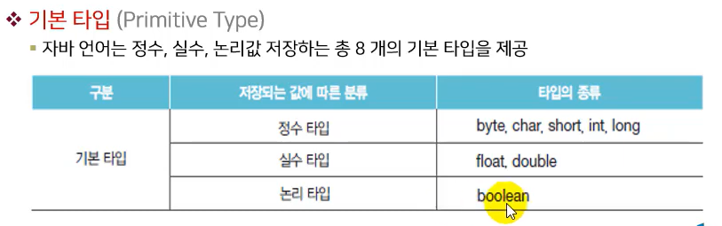
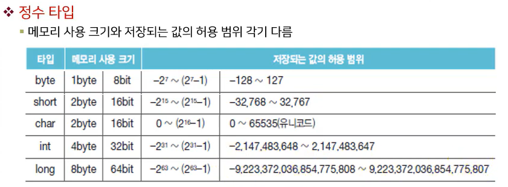
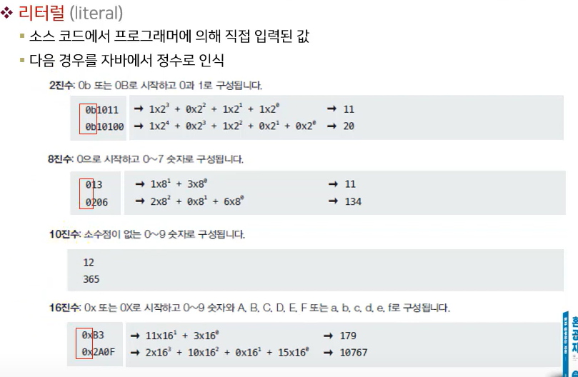

## 2-2 기본 타입

정수,실수,논리값을 저장할 수 있는 기본 타입

#### 기본 타입


#### 정수 타입
char 타입은 문자여서 음수가 없다



#### 정수 타입

- byte
  ```java
  byte b = 100;
  ```

- short
  ```java
  short s = 32000;
  ```

- char
  ```java
  char c = 'A';
  ```
- int
  ```java
  int i = 100000;
  ```

- long
  ```java
  long l = 10000000000L;
  ```

#### 정수 리터럴

[정수 리터럴 예제](_0202_1.java)

정수 리터럴을 int 타입으로 간주
int 타입의 허용 범위를 초과 할 경우
long 타입임을 컴파일러에게 알려야함
  ```java
  long balance = 30000000000;  //컴파일 에러
  long balance = 30000000000L;
  ```

#### char 타입
- 문자 리터럴:작은따옴표(')
- 유니코드:문자 리터럴이 유니코드로 변환되어 저장
  ```java
  char var1='A' // 유니코드: 65
  char var2='B' // 유니코드: 66
  char var3='가' // 유니코드: 44032
  char var4='각' // 유니코드: 44033
  ```

유니코드 → 정수, char → 정수
char 변수에 (')로 감싼 문자가 아니라 **10진수, 16진수**도 유니코드로 가능
 ```java
  char c ='65' // 10진수
  char c ='0x0041' // 16진수
  ```

(') 안에 감싼 문자 리터럴은 유니코드로 변환 int 타입 변수에도 저장 가능
char 타입 변수에 저장시 문자, int 타입 변수에 저장시 유니코드 자체가 출력
```java
  char var1 ='A';
  int var2 ='A';
  System.out.println(var1);  //A를 출력
  System.out.println(var2);  //65를 출력
  ```

#### String 타입
- 문자열:큰 따옴표로 감싼 문자
```java
char var1 = "A";    // X
String var1 = "A";  // O
  ```

#### 이스케이프 문자
자바에서 문자열(`String`)이나 문자(`char`) 안에 **특수 문자**를 표현할 때 사용한다.  
항상 **백슬래시(\\)** 로 시작한다.

- 제어 문자
  - `\n` : 줄바꿈 (new line)
  - `\t` : 탭 (tab)
  - `\b` : 백스페이스 (backspace)
  - `\r` : 캐리지 리턴 (줄 맨 앞으로)
  - `\f` : 폼 피드 (프린터 제어용, 잘 안 씀)

---

- 특수 문자
  - `\'` : 작은따옴표 `'`
  - `\"` : 큰따옴표 `"`
  - `\\` : 역슬래시 `\`

---

- 유니코드
  - `\uXXXX` : 유니코드 문자 (16진수 코드값)
  ```java
  char c = '\u0041'; // 'A'
  ```
[이스케이프 문자 출력 예제](_0202_6.java)

#### 실수 타입

- double
자바의 **기본 실수형**. 대부분의 실수 연산에서 사용.
  ```java
  double d = 3.14159265358979;
  ```

- float
 **f** 또는 **F** 접미사 필요.
  ```java
  float f = 3.14f;
  ```


#### 논리 타입

- boolean
기본값: `false`
`true` / `false` 값만 가능.
  ```java
  boolean flag = true;
  if (flag) {
      System.out.println("참입니다!");
  }
  ```

---

#### 문자 타입

- char
기본값: `'\u0000'` (널 문자)
문자 하나를 표현. 작은따옴표 `' '`로 감싸서 사용.
다국어 표현 가능.
  ```java
  char c1 = 'A';
  char c2 = '한';
  char c3 = '\u0041'; // 'A'
  ```

#### 요약

- 정수형: `byte`, `short`, `int`(기본), `long`  
- 실수형: `float`, `double`(기본)  
- 논리형: `boolean`  
- 문자형: `char`  

👉 자바는 **정수는 int, 실수는 double을 기본 타입**으로 사용한다.

### 핵심정리
- 정수 타입: 정수를 저장할 수 있는 타입으로 byte, short, int, long 타입을 말합니다.
- char 타입: 작은따옴표(')로 감싼 하나의 문자 리터럴을 저장할 수 있는 타입입니다.
- string 타입: 큰따옴표(")로 감싼 문자열을 저장할 수 있는 타입입니다.
- 실수 타입: 실수를 저장할 수 있는 타입으로 float, double 타입을 말합니다.
- boolean 타입: 참과 거짓을 의미하는 true, false를 저장할 수 있는 타입입니다.

### 문제
1. 메모리 사용 크기별 자바 기본 타입
- 정수 타입:1 byte-byte/ 2 byte-short,char/ 4 byte-int/ 8 byte-long
- 실수 타입:4 byte-float/ 8 byte-double
-논리 타입:1 byte-boolean

2. 변수 값 저장 o/x
- byte var = 200; (x)
- char var = 'AB'; (x)
- char var = 65; (o)
- long var = 50000000000; (x)
- float var = 3.14; (x)
- double var = 100.0; (o)
- String var = "나의 직업은 "개발자"입니다." (x)
- boolean var = 0; (x)
- int v2 = le2; (x)
- float = le2f; (x)

3. 코드 실행 시 콘솔에 출력되는 내용은?
System.out.println("자바는");<br>
System.out.println<br>("\n재미있는\"프로그래밍\"언어\n");<br>
System.out.println("입니다.");
(자바는 재미있는 "프로그래밍" 언어입니다.)

4. 코드의 에러 원인은?
double value = 2e-350;
(허용 범위를 벗어남)

5. 코드 실행 시 출력 내용
  ```java
		boolean stop = false;
		if(stop) {
			System.out.println("멈춥니다.");
		} else {
			System.out.println("출발합니다.");
		}
  ```
  (출발합니다.)