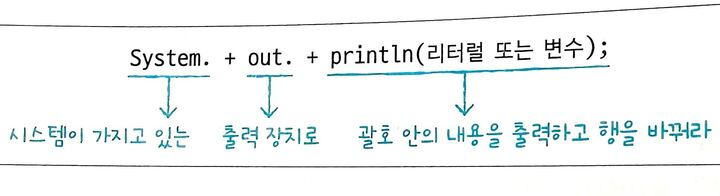
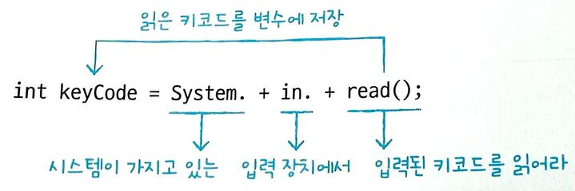
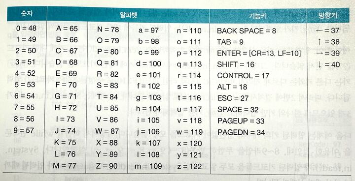

## 2-4 변수와 시스템 입출력

#### 모니터로 변수값 출력하기

println(내용); : 괄호 안의 내용을 출력하고 행을 바꿔라
print(내용); : 괄호 안의 내용을 출력만 해라
printf("형식문자열", 값1, 값2,...); : 괄호 안의 첫 번째 문자열 형식대로 내용을 출력해라

- % : 형식 문자열의 시작
- argument_index$ : 값의 순번
- flags : 생략 시 왼쪽 공백, - 오른쪽 공백, 0 왼쪽 공백 대신 0으로 채워짐
- width : 전체 자릿수
- .precision : 소수 자릿수
- conversion : 값의 타입에 따라 d(정수), f(실수), s(문자)

#### printf 형식 지정자 요약

| 구분 | 서식 지정자 | 옵션 | 설명 | 출력 예시 (`값=123`, `값=3.14`, `"Hi"`) |
|------|-------------|------|------|-----------------------------------|
| **정수** | `%d` | 기본 | 10진수 정수 출력 | `123` |
|      | `%5d` | 공백 | 전체 5칸 확보, 오른쪽 정렬 | `  123` |
|      | `%-5d` | `-` | 전체 5칸 확보, 왼쪽 정렬 | `123  ` |
|      | `%05d` | `0` | 전체 5칸 확보, 빈칸을 0으로 채움 | `00123` |
| **실수** | `%f` | 기본 | 소수점 이하 6자리 출력 | `3.140000` |
|      | `%.2f` | 기본 | 소수점 둘째 자리까지 출력 | `3.14` |
|      | `%8.2f` | 공백 | 전체 8칸 확보, 오른쪽 정렬 | `    3.14` |
|      | `%-8.2f` | `-` | 전체 8칸 확보, 왼쪽 정렬 | `3.14    ` |
|      | `%08.2f` | `0` | 전체 8칸 확보, 빈칸 0으로 채움 | `00003.14` |
| **문자열** | `%s` | 기본 | 문자열 그대로 출력 | `Hi` |
|      | `%5s` | 공백 | 전체 5칸 확보, 오른쪽 정렬 | `   Hi` |
|      | `%-5s` | `-` | 전체 5칸 확보, 왼쪽 정렬 | `Hi   ` |
| **특수문자** | `%%` | 기본 | `%` 자체 출력 | `%` |
|      | `\n` | 기본 | 줄바꿈 | (개행됨) |
|      | `\t` | 기본 | 탭 간격 | `Hi    123` |

#### 키보드에서 입력된 내용을 변수에 저장하기

