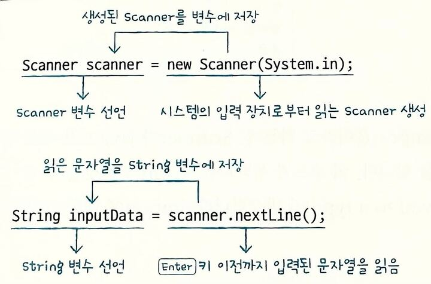

## 2-4 변수와 시스템 입출력

#### 모니터로 변수값 출력하기


println(내용); : 괄호 안의 내용을 출력하고 행을 바꿔라
print(내용); : 괄호 안의 내용을 출력만 해라
printf("형식문자열", 값1, 값2,...); : 괄호 안의 첫 번째 문자열 형식대로 내용을 출력해라

- % : 형식 문자열의 시작
- argument_index$ : 값의 순번
- flags : 생략 시 왼쪽 공백, - 오른쪽 공백, 0 왼쪽 공백 대신 0으로 채워짐
- width : 전체 자릿수
- .precision : 소수 자릿수
- conversion : 값의 타입에 따라 d(정수), f(실수), s(문자)

#### printf 형식 지정자 요약

| 구분 | 서식 지정자 | 옵션 | 설명 | 출력 예시 (`값=123`, `값=3.14`, `"Hi"`) |
|------|-------------|------|------|-----------------------------------|
| **정수** | `%d` | 기본 | 10진수 정수 출력 | `123` |
|      | `%5d` | 공백 | 전체 5칸 확보, 오른쪽 정렬 | `  123` |
|      | `%-5d` | `-` | 전체 5칸 확보, 왼쪽 정렬 | `123  ` |
|      | `%05d` | `0` | 전체 5칸 확보, 빈칸을 0으로 채움 | `00123` |
| **실수** | `%f` | 기본 | 소수점 이하 6자리 출력 | `3.140000` |
|      | `%.2f` | 기본 | 소수점 둘째 자리까지 출력 | `3.14` |
|      | `%8.2f` | 공백 | 전체 8칸 확보, 오른쪽 정렬 | `    3.14` |
|      | `%-8.2f` | `-` | 전체 8칸 확보, 왼쪽 정렬 | `3.14    ` |
|      | `%08.2f` | `0` | 전체 8칸 확보, 빈칸 0으로 채움 | `00003.14` |
| **문자열** | `%s` | 기본 | 문자열 그대로 출력 | `Hi` |
|      | `%5s` | 공백 | 전체 5칸 확보, 오른쪽 정렬 | `   Hi` |
|      | `%-5s` | `-` | 전체 5칸 확보, 왼쪽 정렬 | `Hi   ` |
| **특수문자** | `%%` | 기본 | `%` 자체 출력 | `%` |
|      | `\n` | 기본 | 줄바꿈 | (개행됨) |
|      | `\t` | 기본 | 탭 간격 | `Hi    123` |

#### 키보드에서 입력된 내용을 변수에 저장하기

- 아스키코드


- 입력된 키코드를 변수에 저장
    - a + Enter 입력 시 97, 13, 10 출력
    - a → 아스키코드 97
   -  Enter → 두 개의 제어 코드 입력됨
    - 13 = Carriage Return (CR)
    - 10 = Line Feed (LF)
    - 따라서 a 입력 후 엔터 치면 → 97, 13, 10 출력됨.

- while(true) 무한 반복
    - 조건이 항상 참(true) → 반복이 끝나지 않고 무한 루프 실행.
    - 보통 특정 키 입력이나 break문으로 종료 조건을 만들어야 함.

- q 입력 시 반복 종료 (keyCode == 113)
    - q의 아스키코드 = 113
    - 입력값이 113과 같을 때 → 조건식 keyCode == 113이 true가 되어
    - break 실행 → 무한 루프 종료됨.

- Scanner 클래스

[입력된 내용 문자열로 열기 예제](_0204_5.java)

- equals() 메소드

== : 주소(참조) 비교 → 같은 객체인지 확인

equals() : 값(내용) 비교 → 값이 같은지 확인

Object 기본 equals()는 ==와 같지만, String 같은 클래스는 값 비교하도록 재정의되어 있음.

👉 그래서 문자열 비교할 땐 항상 equals()를 써야 함!


#### 핵심 정리
- System.out.println() : 괄호에 주어진 매개값을 모니터로 출력하고 개행을 합니다.
- System.out.print() : 괄호에 주어진 매개값을 모니터로 출력하되, 개행을 하지 않습니다.
- System.out.printf() : 괄호에 주어진 형식화 문자열을 출력합니다.
- System.in.read() : 키보드에서 입력된 키코드를 읽습니다.
- Scanner : System.in.read()는 키코드 한 개씩 읽기 때문에 2개 이상의 키가 조합된 한글을 읽을 수 없습니다. 키보드로부터 입력된 내용을 한 문자 단위로 읽기 위해서는 Scanner를 사용할 수 있습니다.

#### 문제

1. 다음과 같이 출력되도록 ⬜① ~ ⬜③에 들어갈 코드를 작성해보세요.

이름: 감자바
나이: 25
전화: 010-123-4567

```java
String name = "감자바";
int age = 25;
String tel1="010", tel2="123", tel3="4567";

System.out.printIn(⬜①);
System.out.print(⬜②);
System.out.printf(⬜③);
```
> 1- "이름:" + name
println이 행을 바꿔주니 이름과 변수만 입력
2- "나이:" + age + "\n"
print는 자동 줄 바꿈x \n을 붙여야함
3- "전화: %s-%s-%s\n", tel1, tel2, tel3
형식 지정자 활용 tel1.2.3이 문자열 타입(String)이므로 %s 사용한 후 뒤에 변수를 끼워 넣음, printf는 줄 바꿈이 안되므로\n을 붙이는게 좋음


2. Scanner를 이용해서 키보드로 입력한 두 수를 덧셈하여 결과를 출력하고자 합니다.
⬜① ~ ⬜③에 들어갈 코드를 작성해보세요.

```java
Scanner scanner = new Scanner(System.in);

System.out.print("첫 번째 수: ");
String strNum1 = ⬜①;

System.out.print("두 번째 수: ");
String strNum2 = ⬜②;

int num1 = ⬜③;
int num2 = ⬜③;
int result = num1 + num2;
System.out.println("덧셈 결과: " + result);
```
> 1,2 scanner.nextLine()
키보드에 입력된 내용을 통 문자열로 읽기 위해 scanner
메소드를 사용했으니 scanner키보드를 읽기 위한 메소드인 scanner.nextLine() 메소드를 사용
3,4 Integer.parseInt()
strNum1은 문자열 이므로 문자열을 정수로 바꿔야함 int num1 이므로 문자열을 int타입으로 변환해주는 Integer.parseInt()을 써야함

3. Scanner를 이용해서 이름, 주민번호 앞 6자리, 전화번호를 키보드에서 입력받고 출력하는 코드를 작성해보세요.

```java
[필수 정보 입력]
1. 이름: 홍길동
2. 주민번호 앞 6자리: 123456
3. 전화번호: 010-123-1234

[입력된 내용]
1. 이름: 홍길동
2. 주민번호 앞 6자리: 123456
3. 전화번호: 010-123-1234
```
[문제3 연습 코드](_0204_Q3.java)
> System.out.println() & System.out.print()
println : 출력 후 줄바꿈
print : 줄바꿈 없이 같은 줄에 입력할 수 있게 함

> String name = scanner.nextLine();
nextLine()은 사용자가 입력하고 Enter 친 한 줄 전체를 문자열로 읽음
이름, 주민번호, 전화번호 모두 문자열이므로 그대로 저장

```java
Exception {
		Scanner scanner = new Scanner(System.in);

		System.out.println("[필수 정보 입력]");

		System.out.print("1. 이름: ");
		String name = scanner.nextLine();

		System.out.print("2. 주민번호 앞 6자리: ");
		String ssn = scanner.nextLine();

		System.out.print("3. 전화번호: ");
		String tel = scanner.nextLine();

		System.out.println();
		System.out.println("[입력된 내용]");
		System.out.println("1. 이름: " + name);
		System.out.println("2. 주민번호 앞 6자리: " + ssn);
		System.out.println("3. 전화번호: " + tel);

		System.out.println("종료");
	}
    ```