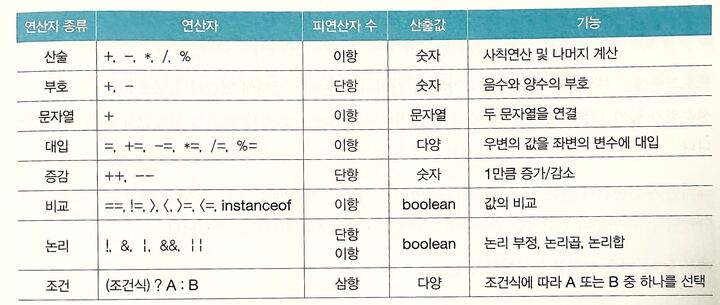
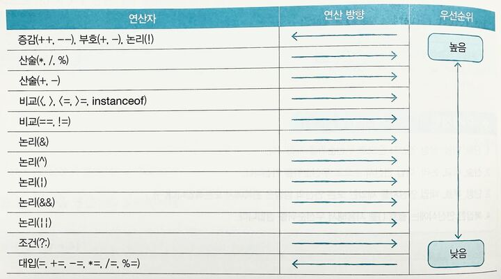

# chapter3 연산자
## 3-1 연산자와 연산식

연산자: 연산에 사용되는 표시나 기호 +,-,*,==
피연산자: 연산되는 데이터 x,y,z
```java
x+y
x-y
x*y+z
x==y
  ```
#### 연산자의 종류


1. 산술 연산자
- `+`, `-`, `*`, `/`, `%`
- 숫자 계산 (사칙연산, 나머지)

2. 부호 연산자
- `+`, `-`
- 숫자의 양수/음수 부호

3. 문자열 연산자
- `+`
- 문자열 연결

4. 대입 연산자
- `=`, `+=`, `-=`, `*=`, `/=`, `%=`
- 변수에 값 대입 및 갱신

5. 증감 연산자
- `++`, `--`
- 변수의 값을 1 증가/감소

6. 비교 연산자
- `==`, `!=`, `>`, `<`, `>=`, `<=`, `instanceof`
- 두 값 비교 → boolean 반환

7. 논리 연산자
- `!`, `&&`, `||`
- 논리 부정, AND, OR → boolean 반환

8. 조건(삼항) 연산자
- `(조건식) ? A : B`
- 조건에 따라 A 또는 B 선택

#### 연산의 방향과 우선순위

##### 🥇 1단계 (가장 먼저)
- `()` 괄호  
- 단항: `!` `++` `--` `+` `-`

➡️ **항상 먼저 계산됨**

---

##### 🥈 2단계 (중간)
1. 산술  
   - `*` `/` `%`  
   - `+` `-`
2. 비교  
   - `<` `<=` `>` `>=`  
   - `==` `!=` `===` `!==`
3. 논리  
   - `&&` (AND)  
   - `||` (OR)

➡️ **계산 → 비교 → 논리 순서**

---

##### 🥉 3단계 (마지막)
- 삼항: `조건 ? A : B`  
- 대입: `=`, `+=`, `-=`, `*=`, `/=`, `%=`  
- 쉼표: `,`

➡️ **결과 확정 & 값 저장**

---

##### ✅ 암기 팁
1. **괄호·단항 먼저**  
2. **산술 → 비교 → 논리**  
3. **조건 → 대입 → 쉼표**

#### 핵심 정리
- 연산자: 연산의 종류를 결정짓는 기호를 말합니다. 산술(+ , - , * , / , %), 증감(++ , --), 비교(==, !=, >, <, >=, <=), 대입(=, +=, -= …), 논리(&&, ||, !), 대입(=, +=, -=, ...) 등이 있습니다.  

- 피연산자: 연산식에서 연산되는 데이터(값)를 말합니다. 예를 들어, `3 + x` 에서는 `3과 x`가 피연산자입니다.

- 연산 방향: 연산식에서 같은 종류의 연산자가 여러 개 사용될 경우, 왼쪽에서 오른쪽으로 또는 오른쪽에서 왼쪽으로 연산됩니다. 대부분의 연산자는 **왼쪽 → 오른쪽**으로 연산됩니다.  단, 증감(++ , --), 부호(+ , -), 대입(=, += …)은 **오른쪽 → 왼쪽**으로 연산됩니다.  

- 연산 우선순위: 서로 다른 연산자들의 복합적인 구성일 때, 우선적으로 연산되는 연산자가 있습니다. 하지만 괄호 `()`로 감싸면 최우선적으로 연산되므로, 복잡한 연산식에서는 괄호 사용을 권장합니다.  

**연산 방향과 우선순위 표**


#### 문제
1. 연산자와 연산식에 대한 설명 중 틀린 것은 무엇입니까? (   )

- 1. 연산자는 피연산자의 수에 따라 단항, 이항, 삼항 연산자로 구분된다.  
- 2. 비교 연산자와 논리 연산자의 산출 타입은 boolean(true/false) 타입이다.  
- 3. 연산식은 하나 이상의 값을 산출할 수도 있다.  
- 4. 하나의 값이 올 수 있는 자리라면 연산식도 올 수 있다.  
> - 3. 연산식은 항상 하나의 값만 산출할 수 았고 "여러 데이터를 담은 하나의 값"일 수는 있어도 "값이 여러 개 동시에 나오는 것"은 없음

2. 연산의 방향과 연산 우선순위에 대한 설명 중 틀린 것은 무엇입니까? (   )

- 1. 산술 연산자(+ , - , * , /)는 연산 방향이 왼쪽에서 오른쪽으로 수행된다.  
- 2. 대입 연산자(= , += …)는 연산 방향이 오른쪽에서 왼쪽으로 수행된다.  
- 3. 우선순위와 관계없이 먼저 연산을 하고 싶다면 괄호 `()`로 묶어준다.  
- 4. 논리 연산자(&& , ||)는 산술 연산보다 우선 수행된다.  
> - 4. 산술 연산 → 비교 연산 → 논리 연산 순서입니다